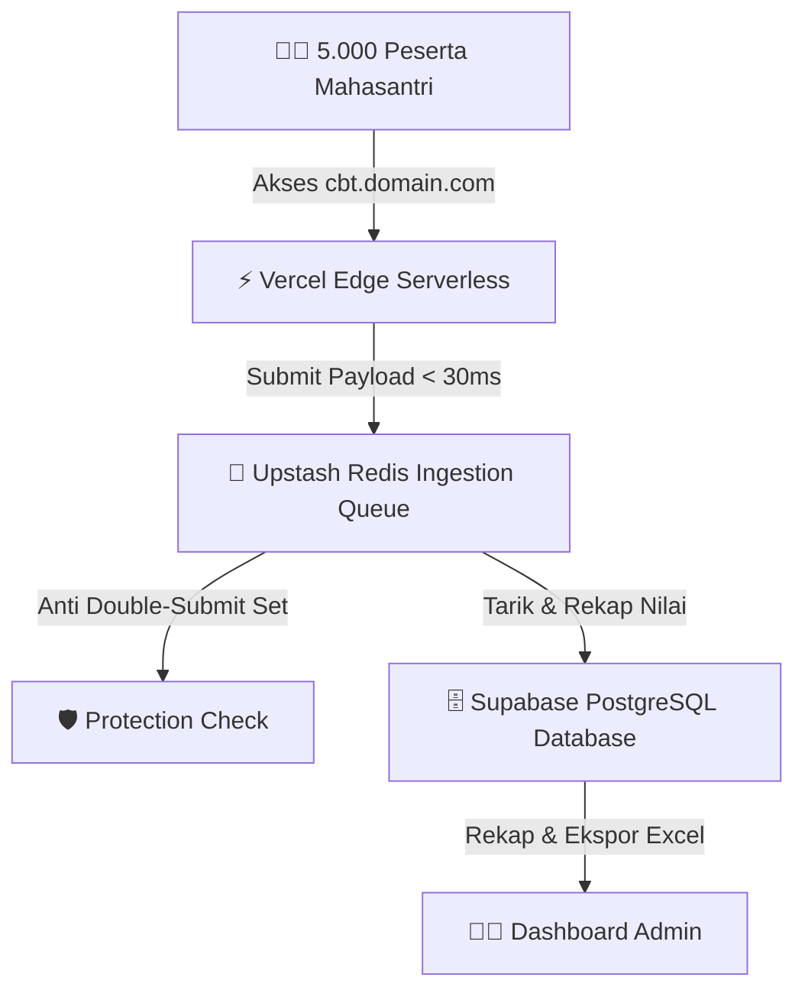

# 🕌 Taklim CBT - Serverless Placement Test Engine

[](https://nextjs.org/)
[](https://upstash.com/)
[](https://supabase.com/)
[](https://tailwindcss.com/)
[](#license)

**Taklim CBT** adalah platform *Computer Based Test (CBT)* modern berkecepatan tinggi yang dirancang khusus untuk **Placement Test Mahad Al-Jamiah Al-Aliyah (MSAA) UIN Malang**. Platform ini mampu menampung hingga **5.000 peserta secara serentak** dengan latensi pengumpulan jawaban sangat rendah (*< 30 ms*) memanfaatkan arsitektur *Serverless Ingestion Buffer*.

---

## 🌟 Fitur Utama

- 🎨 **Minimalist Dark Luxe UI & Frosted Glass Design**: Antarmuka transparan modern berbasis *Deep Obsidian Slate* dengan latar belakang drone foto udara kampus Ma'had.
- ⚡ **High-Speed Ingestion Queue (Upstash Redis)**: Menampung lonjakan 5.000 submit serentak ke memori RAM berkecepatan tinggi tanpa membuat database overload.
- 🗄️ **Supabase PostgreSQL Persistence**: Sinkronisasi otomatis data nilai akhir, identitas peserta, dan rincian jawaban per nomor secara permanen.
- 📅 **Multi-Category Scheduling & Isolation**: Isolasi bidang tes terpisah (*Taklim Afkar* & *Taklim Al-Qur'an*) dengan antrean dan kunci jawaban terpisah per hari tes.
- 🔑 **Dynamic Exam Token Control**: Admin dapat memperbarui **Token Ujian Masal** secara langsung dari Dashboard Admin tanpa perlu merestart server.
- 🛡️ **Silent Anti-Cheat Tracking**: Melacak jumlah perpindahan tab/browser secara *silent* di latar belakang tanpa pop-up mengganggu peserta.
- 🎲 **Deterministic Per-Candidate Shuffling**: Mengacak urutan soal dan pilihan jawaban (A-D) secara unik per peserta berbasis PRNG Mulberry32 yang ditiupkan dari NIM.
- 📊 **Excel Import & Multi-Sheet Export**: Form Builder cerdas berbasis upload template Excel dan ekspor rekap nilai dalam format Excel Multi-Sheet (.xlsx).

---

## 🏗️ Arsitektur Sistem



---

## 🛠️ Stack Teknologi (100% Free-Tier Compatible)

| Layer | Teknologi | Deskripsi |
| --- | --- | --- |
| **Framework** | **Next.js 14 (App Router)** | Framework React full-stack dengan fitur Serverless API Routes. |
| **Styling** | **Tailwind CSS + Lucide Icons** | Design System Minimalist Dark Luxe dengan efek Glassmorphism. |
| **Ingestion Buffer** | **Upstash Redis Free** | Memory Queue penampung 5.000 submit serentak dalam memori RAM. |
| **Primary Database** | **Supabase PostgreSQL** | Database utama untuk penyimpanan bank soal dan rekap nilai permanen. |
| **Parsing & Report** | **XLSX (SheetJS)** | Pembacaan template Excel soal dan generator laporan Excel Multi-Sheet. |
| **Deployment** | **Vercel / Cloudflare Pages** | Hosting Serverless Auto-Scaling instan. |

---

## 🚀 Memulai (Local Development)

### 1. Prasyarat
- Node.js versi 18.x atau lebih baru
- NPM / Yarn / PNPM

### 2. Kloning Repository & Install Dependensi
```bash
git clone https://github.com/hmblpjk/taklim-cbt.git
cd taklim-cbt
npm install
```

### 3. Konfigurasi Variabel Lingkungan (`.env.local`)
Buat file `.env.local` di direktori utama:
```env
# System Passwords & Tokens
NEXT_PUBLIC_EXAM_TOKEN=TAKLIM2026
ADMIN_PASSWORD=admin123

# Upstash Redis
UPSTASH_REDIS_REST_URL=https://your-instance.upstash.io
UPSTASH_REDIS_REST_TOKEN=your_upstash_token

# Supabase PostgreSQL
NEXT_PUBLIC_SUPABASE_URL=https://your-project.supabase.co
SUPABASE_SERVICE_ROLE_KEY=your_service_role_key
```

### 4. Menjalankan Server Pengembang
```bash
npm run dev
```
Buka [http://localhost:3000](http://localhost:3000) untuk Portal Peserta dan [http://localhost:3000/admin](http://localhost:3000/admin) untuk Portal Admin.

---

## 🗄️ Skema Database Supabase PostgreSQL

Jalankan skrip SQL berikut pada **[Supabase SQL Editor](https://supabase.com/dashboard)**:

```sql
-- 1. Tabel Bank Soal Multi-Kategori
CREATE TABLE IF NOT EXISTS exam_questions (
  id BIGINT GENERATED BY DEFAULT AS IDENTITY PRIMARY KEY,
  category_id VARCHAR(50) NOT NULL DEFAULT 'afkar',
  question_number INT NOT NULL,
  question_text TEXT NOT NULL,
  options JSONB NOT NULL,
  answer_key VARCHAR(5) NOT NULL,
  created_at TIMESTAMPTZ DEFAULT NOW(),
  updated_at TIMESTAMPTZ DEFAULT NOW(),
  UNIQUE(category_id, question_number)
);

-- 2. Tabel Hasil Rekap Ujian
CREATE TABLE IF NOT EXISTS exam_results (
  id BIGINT GENERATED BY DEFAULT AS IDENTITY PRIMARY KEY,
  nim VARCHAR(50) NOT NULL,
  nama VARCHAR(255) NOT NULL,
  mabna VARCHAR(100) NOT NULL,
  kategori VARCHAR(50) NOT NULL,
  kategori_name VARCHAR(100) NOT NULL,
  score INT NOT NULL,
  total_questions INT NOT NULL,
  percentage INT NOT NULL,
  tab_switches INT NOT NULL DEFAULT 0,
  duration_seconds INT NOT NULL DEFAULT 0,
  answers JSONB NOT NULL,
  submitted_at TIMESTAMPTZ DEFAULT NOW(),
  UNIQUE(nim, kategori)
);

-- Matikan RLS agar Serverless Function dapat melakukan Upsert tanpa hambatan
ALTER TABLE exam_questions DISABLE ROW LEVEL SECURITY;
ALTER TABLE exam_results DISABLE ROW LEVEL SECURITY;

-- Indeks Performa
CREATE INDEX IF NOT EXISTS idx_exam_results_kategori ON exam_results(kategori);
CREATE INDEX IF NOT EXISTS idx_exam_results_nim ON exam_results(nim);
CREATE INDEX IF NOT EXISTS idx_exam_questions_category ON exam_questions(category_id);
```

---

## 🌐 Menghubungkan Subdomain Custom (Hostdata / DirectAdmin)

1. Buka **Vercel Dashboard ➔ Settings ➔ Domains** ➔ Tambahkan `cbt.domainmu.com`.
2. Buka **DirectAdmin Hostdata ➔ DNS Management** ➔ Edit / Tambahkan Record CNAME:
   - **Type**: `CNAME`
   - **Name**: `cbt`
   - **Value**: `cname.vercel-dns.com` *(atau CNAME Vercel yang diberikan)*.

---

## 📂 Struktur Direktori Proyek

```text
cbt/
├── images/                   # Asset gambar referensi UI & Drone Kampus
├── public/
│   └── images/
│       └── bg-mahad.jpg      # Foto udara latar belakang login & admin
├── src/
│   ├── app/
│   │   ├── admin/page.tsx    # Portal Admin & Form Builder & Rekap
│   │   ├── exam/page.tsx     # Engine Ujian Peserta & Timer
│   │   ├── api/              # API Routes (submit, drain, status, publish, export)
│   │   ├── globals.css       # Design System Tokens Minimalist Dark Luxe
│   │   └── page.tsx          # Portal Login Peserta (Frosted Glass)
│   └── lib/
│       ├── constants.ts      # Definisi Tipe, Mabna List, Kategori Ujian
│       ├── excel-parser.ts   # Reader Excel & Generator Multi-Sheet Report
│       ├── randomizer.ts     # Seeded PRNG Mulberry32 Shuffler
│       ├── redis.ts          # Singleton Upstash Redis SDK Client
│       └── supabase.ts       # Singleton Supabase Client & Local DB Proxy
├── .env.example              # Template variabel lingkungan
├── prd.md                    # Product Requirement Document
├── README.md                 # Dokumentasi proyek ini
└── supabase_schema.sql       # Skrip otomatisasi tabel Supabase
```

---

## 📜 Lisensi

Proyek ini dilindungi di bawah lisensi **MIT License** — Bebas digunakan dan dikembangkan untuk keperluan akademik dan operasional Ma'had Al-Jamiah Al-Aliyah (MSAA) UIN Malang.
